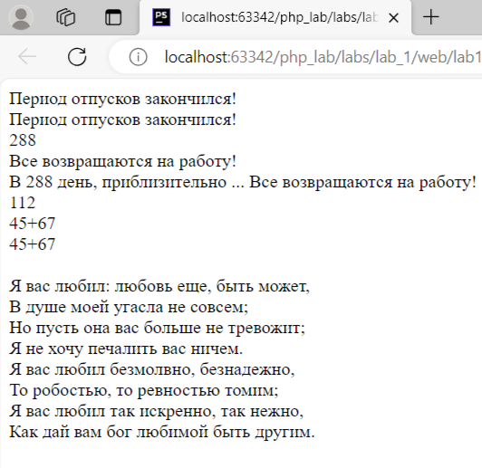

# Отчет по первой лабораторной работе

1. Инструкции по запуску проекта
2. Описание лабораторной работы
3. Краткая документация к проекту
4. Примеры использования проекта с приложением скриншотов или фрагментов кода
5. Список использованных источников

# 1.Инструкции по запуску проекта

1. Клонируйте репозиторий:
   ```bash
   https://github.com/sharishi/php_labs.git
2. Перейдите в каталог проекта:
   ```bash 
   cd labs
3. Запустите проект:  
   Если у вас есть веб-сервер (например, Apache или Nginx), настройте его так, чтобы корневой каталог указывал на
   каталог вашего проекта.  
   Если у вас нет веб-сервера, вы можете использовать встроенный сервер PHP для тестирования:
   ```bash 
   php -S localhost:8000 lab_1\web\lab1.php

## 2. Описание лабораторной работы

Лабораторная работа представляет собой PHP-скрипт, который выводит на экран заданные в лабораторной сообщения. В
процессе выполнения скрипта используются различные методы вывода текста, включая echo, print, и синтаксис heredoc для
многострочного текста. Также демонстрируется работа с переменными, вложенные выражения в строках и выполнение
арифметических операций. Проект включает в себя примеры использования различных возможностей языка PHP для работы с
текстом и переменными.

## 3. Краткая документация к проекту

#### Вызовы echo и print для вывода сообщений

```php
<?php
echo "Период отпусков закончился! <br />";
print "Период отпусков закончился! <br />";
```

#### Объявление переменных и их вывод

```php
<?php
$int = 288;
$string = "Все возвращаются на работу!";
print $int . "<br />";
echo $string . "<br />";
```

#### Интерполяция строк

```php
<?php
echo "В {$int} день, приблизительно ... {$string} <br />";
```

#### Математические операции и конкатенация строк

```php
<?php
echo 45 + 67 . "<br />";
echo "45+67" . "<br />";
echo '45+67' . "<br />";
```

#### Выполнение команды оболочки с использованием обратных кавычек

```php
<?php
print `Книга "Герой" выйдет в октябре, этого года! <br />`;
```

#### Блок heredoc для поэмы

```php
<?php
echo <<<EOD
<br />
Я вас любил: любовь еще, быть может, <br />
В душе моей угасла не совсем; <br />
Но пусть она вас больше не тревожит; <br />
Я не хочу печалить вас ничем. <br />
Я вас любил безмолвно, безнадежно, <br />
То робостью, то ревностью томим; <br />
Я вас любил так искренно, так нежно, <br />
Как дай вам бог любимой быть другим. <br />
EOD;
?>
```

# 4. Пример использования проекта (с приложением скриншотов)



# 5. Список использованных источников

1. [Запуск проекта с gitHub](https://www.youtube.com/watch?v=6fHsk1v3qys)
<!-- 2. [Документация по composter.json](https://getcomposer.org/doc/04-schema.md#json-schema)-->