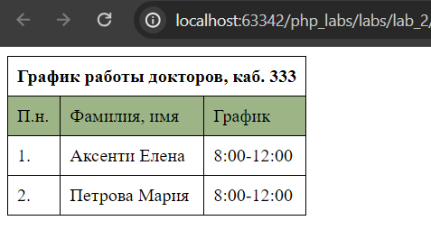

# Отчет по второй лабораторной работе

1. [Инструкции по запуску проекта](#1-инструкции-по-запуску-проекта).
2. [Описание проекта](#2-описание-проекта).
3. [Краткая документация к проекту](#3-краткая-документация-к-проекту).
4. [Примеры использования проекта с приложением скриншотов или фрагментов кода](#4-пример-использования-проекта-с-приложением-скриншотов).
5. [Список использованных источников](#5-список-использованных-источников).

## 1. Инструкции по запуску проекта

Данные инструкции действительны при использовании PhpStorm, в ином случае, воспользуйтесь приведенной ссылкой:
[запуск проекта с gitHub](https://www.youtube.com/watch?v=6N6JFynR0gM)

1. Клонируйте репозиторий:
   ```bash
   https://github.com/sharishi/php_labs.git
2. Запустите проект:
   <!-- Если у вас есть веб-сервер (например, Apache или Nginx), настройте его так, чтобы корневой каталог указывал на
   каталог вашего проекта.  
   Если у вас нет веб-сервера, вы можете использовать встроенный сервер PHP для тестирования: -->
   ```bash 
   php -S localhost:8000 labs\lab_2\web\lab2.php

## 2. Описание проекта

В данной лабораторной работе была создана HTML-таблица, где в качестве значения колонки "График работы",
был подставлен вызов php-функции. Эта функция ориентируется на текущую дату и устанавливает соответствующий график
работы докторов.

## 3. Краткая документация к проекту

#### Таблица, отображающая график работы докторов:

```html

<table class="sweb">
    <tbody>
    <!-- Заголовок таблицы -->
    <tr>
        <td colspan="3"><b>График работы докторов, каб. 333</b></td>
    </tr>
    <!-- Строка таблицы для заголовков столбцов -->
    <tr class="highlighted-row">
        <td>П.н.</td>
        <td>Фамилия, имя</td>
        <td>График</td>
    </tr>
    <!-- Строка таблицы для первого доктора -->
    <tr>
        <td>1.</td>
        <td>Аксенти Елена</td>
        <!-- Вывод графика работы первого доктора с помощью вызова функции -->
        <td><?php echo getWorkingHours(); ?></td>
    </tr>
    <!-- Строка таблицы для второго доктора -->
    <tr>
        <td>2.</td>
        <td>Петрова Мария</td>
        <!-- Вывод графика работы второго доктора с помощью вызова функции -->
        <td><?php echo getWorkingHours(); ?></td>
    </tr>
    </tbody>
</table>
```

#### Определение функции для получения графика работы в зависимости оттекущего дня недели:

```php
<?php
function getWorkingHours() {
    // Получаю текущий день недели 
    $currentDayOfWeek = date('N');
```

#### Условие установления графика:

```php
    if ($currentDayOfWeek == 1 || $currentDayOfWeek == 3 || $currentDayOfWeek == 5) {
        return "8:00-12:00"; // График работы для понедельника, среды и пятницы
    } elseif ($currentDayOfWeek == 2 || $currentDayOfWeek == 4 || $currentDayOfWeek == 6) {
        return "12:00-16:00"; // График работы для вторника, четверга и субботы
    } else {
        return "Нерабочий день"; // В случае, если текущий день недели не совпадает ни с одним из условий
        }
  }
```

## 4. Пример использования проекта (с приложением скриншотов)



## 5. Список использованных источников

1. [Интеграция PHP в HTML](https://www.internet-technologies.ru/articles/php-v-html.html)
2. [Функции в PHP](https://www.php.net/manual/ru/functions.user-defined.php)