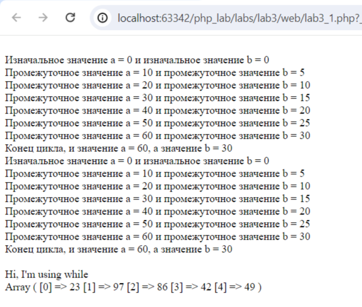
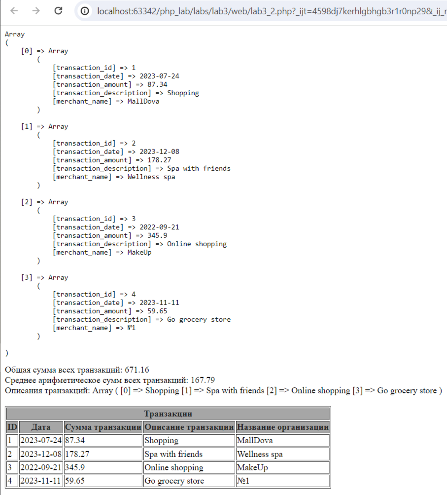
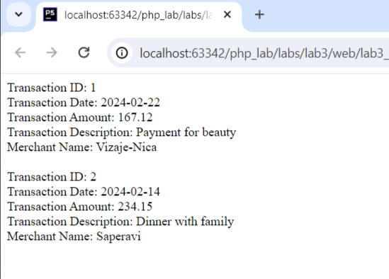
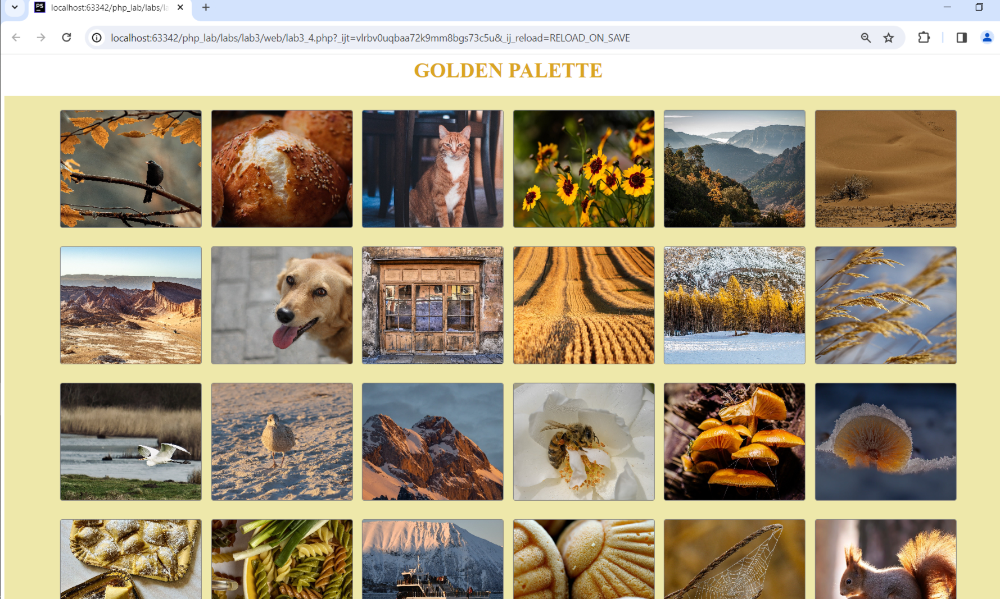

# Отчет по третьей лабораторной работе

1. [Инструкции по запуску проекта](#1-инструкции-по-запуску-проекта).
2. [Описание проекта](#2-описание-проекта).
3. [Краткая документация к проекту](#3-краткая-документация-к-проекту).
4. [Примеры использования проекта с приложением скриншотов или фрагментов кода](#4-пример-использования-проекта-с-приложением-скриншотов).
5. [Список использованных источников](#5-список-использованных-источников).

## 1. Инструкции по запуску проекта

Данные инструкции действительны при использовании PhpStorm, в ином случае, воспользуйтесь приведенной ссылкой:
[запуск проекта с gitHub](https://www.youtube.com/watch?v=6N6JFynR0gM)

1. Клонируйте репозиторий:
   ```bash
   https://github.com/sharishi/php_labs.git
2. Запустите проект:
   <!-- Если у вас есть веб-сервер (например, Apache или Nginx), настройте его так, чтобы корневой каталог указывал на
   каталог вашего проекта.  
   Если у вас нет веб-сервера, вы можете использовать встроенный сервер PHP для тестирования: -->
   ```bash 
   php -S localhost:8000 labs\lab_3\web\lab3_1.php
   php -S localhost:8000 labs\lab_3\web\lab3_2.php
   php -S localhost:8000 labs\lab_3\web\lab3_3.php
   php -S localhost:8000 labs\lab_3\web\lab3_4.php

## 2. Описание проекта

Лабораторная работа представляет собой PHP-скрипт, который динамически формирует галерею изображений.

1. В первой части лабораторной(lab3_1) создаем функции try_for и try_while для демонстрации работы циклов for и while, а
   также
   функцию generate_random_array, которая генерирует массив случайных чисел и выводит его в консоль.
2. Вторая часть лабораторной(lab3_2) представляет собой систему управления транзакциями. Был создан массив
   $transactions для хранения данных о транзакциях. Функции addTransaction, calculateTotalAmount и calculateAverage
   обеспечивают добавление транзакций, расчет общей и средней суммы. Также реализована функция
   mapTransactionDescriptions
   для создания массива описаний транзакций. Данные выводятся в HTML-таблицу с использованием цикла foreach. Код
   структурирован, читаем и может быть дополнен функциональностью, такой как сортировка транзакций.
3. Третья часть лабораторной(lab3_3) демонстрирует возможности ООП в php. Создаю класс Transaction, конструктор к этому
   классу и далее уже создаю массив обьектов этого класса и иттерируюсь по нему, присваиваивая значения с помощью
   конструктора
   инициализации, а затем через цикл вывожу их.
4. Четвертая часть лабораторной(lab3_4) использует PHP для сканирования директории с изображениями и формирования
   галереи
   на веб-странице.
   Страница содержит стилизованный заголовок, контейнер с изображениями, которые загружаются динамически.
   Каждое изображение выводится в отдельном блоке с применением стилей, создавая эстетичный визуальный эффект.

## 3. Краткая документация к проекту

#### Lab3_1

```php
// Функция try_for с использованием цикла for
function try_for($a, $b)
{
    echo "<br />Изначальное значение a = " . $a . " и изначальное значение b = " . $b;
    for ($i = 0; $i <= 5; $i++) {
        $a += 10;
        $b += 5;
        echo "<br />Промежуточное значение a = " . $a . " и промежуточное значение b = " . $b;
    }
    echo "<br />Конец цикла, и значение a = " . $a . ", а значение b = " . $b;
}
// Функция try_while с использованием цикла while
function try_while($a, $b)
{
    $i = 0;
    echo "<br />Изначальное значение a = " . $a . " и изначальное значение b = " . $b;
    while ($i <= 5) {
        $a += 10;
        $b += 5;
        echo "<br />Промежуточное значение a = " . $a . " и промежуточное значение b = " . $b;
        $i++;
    }
    echo "<br />Конец цикла, и значение a = " . $a . ", а значение b = " . $b;
}
// Функция generate_random_array для генерации массива случайных чисел и его вывода
function generate_random_array()
{
    $arr = [];
    $random_number = rand(1, 2);
    $random_dimension = rand(3, 10);

    // Ветвление на основе случайного числа для выбора типа цикла
    if ($random_number == 1) { ?>
        <br /><br />Hi, I'm using for<br />
        <?php
        for ($i = 0; $i <= $random_dimension; $i++) {
            $arr[$i] = rand(1, 100);
        }
    } else {
        $i = 0;
        echo "<br /><br />Hi, I'm using while<br />";
        while ($i <= $random_dimension) {
            $arr[$i] = rand(1, 100);
            $i++;
        }
    }

```

#### Lab3_2

```php
// Функция addTransaction для добавления новых транзакций
function addTransaction($id, $date, $amount, $description, $merchant, &$transactions)
{
    $newTransaction = [
        "transaction_id" => $id,
        "transaction_date" => $date,
        "transaction_amount" => $amount,
        "transaction_description" => $description,
        "merchant_name" => $merchant,
    ];

    $transactions[] = $newTransaction;
}

// Функция calculateTotalAmount для вычисления общей суммы транзакций
function calculateTotalAmount($transactions)
{
    $sum = 0;
    foreach ($transactions as $transaction) {
        $sum += $transaction['transaction_amount'];
    }
    return $sum;
}


// Функция calculateAverage для вычисления средней суммы транзакций
function calculateAverage($transactions)
{
    $sum = 0

    foreach ($transactions as $transaction) {
        $sum += $transaction['transaction_amount'];
    }

    $totalTransactions = count($transactions);
    return $sum / $totalTransactions;
}

// Функция mapTransactionDescriptions для создания массива описаний транзакций
function mapTransactionDescriptions($transactions)
{
    return array_map(function ($transaction) {
        return $transaction['transaction_description'];
    }, $transactions);
}

?>
```

#### Lab3_3

```php
// Определение класса Transaction с публичными полями
class Transaction {
    public $transaction_id;
    public $transaction_date;
    public $transaction_amount;
    public $transaction_description;
    public $merchant_name;

    // Конструктор с параметрами для инициализации значений свойств
    public function __construct($id, $date, $amount, $description, $merchant) {
        $this->transaction_id = $id;
        $this->transaction_date = $date;
        $this->transaction_amount = $amount;
        $this->transaction_description = $description;
        $this->merchant_name = $merchant;
    }
}
```
#### Lab3_4

```php
// Задаем путь к папке с изображениями
$dir = '../images/lab3_4/';
// Сканируем содержимое директории
// scandir — Получает список файлов и каталогов, расположенных по заданному пути
$files = scandir($dir);
// Если нет ошибок при сканировании
if ($files === false) {
    return;
}
// Итерация по файлам в директории
for ($i = 0;$i < count($files);$i++) {
// Проверка наличия файла или директории "." и ".."
if (($files[$i] != ".") && ($files[$i] != "..")) {
// Формируем полный путь к изображению
   $path = $dir . $files[$i];
   }
}
```

## 4. Пример использования проекта (с приложением скриншотов)

1. [lab3_1](#lab3_1).

   
2. [lab3_2](#lab3_2).

   
3. [lab3_3](#lab3_3).

   
4. [lab3_4](#lab3_4).

   

## 5. Список использованных источников

1. [ООП в PHP](https://code.tutsplus.com/ru/basics-of-object-oriented-programming-in-php--cms-31910t)
2. [Вёрстка на Flexbox в CSS](https://medium.com/@stasonmars/вёрстка-на-flexbox-в-css-полный-справочник-e26662cf87e0)