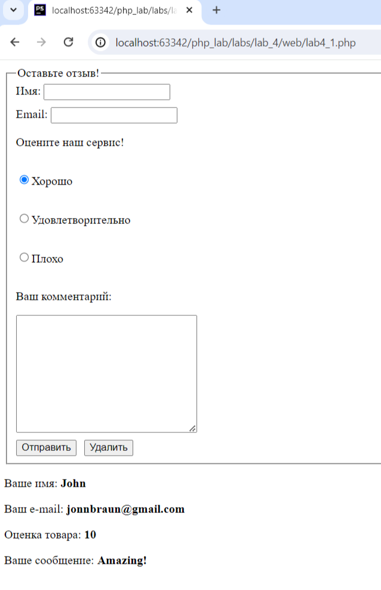
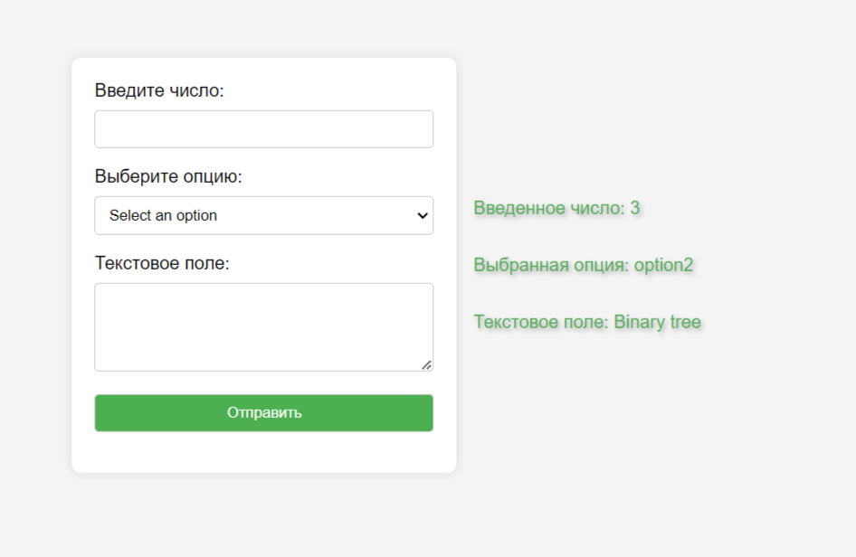
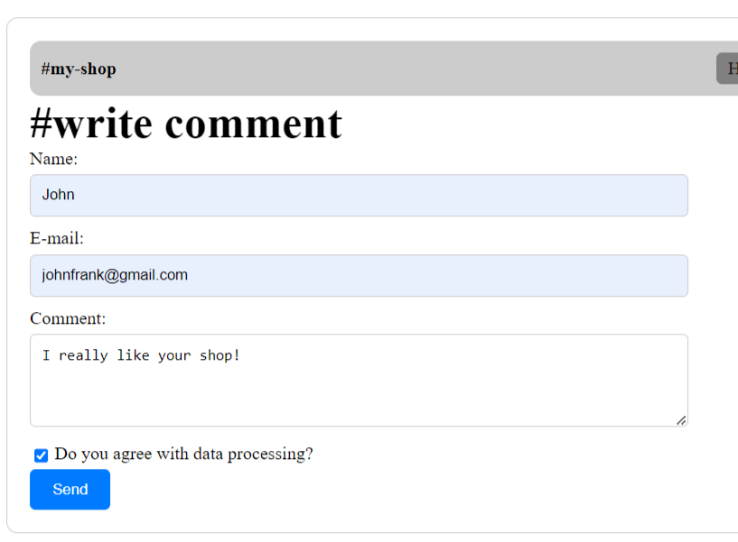
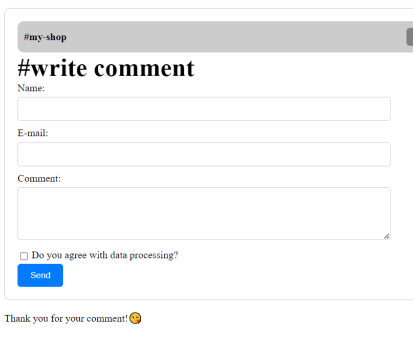
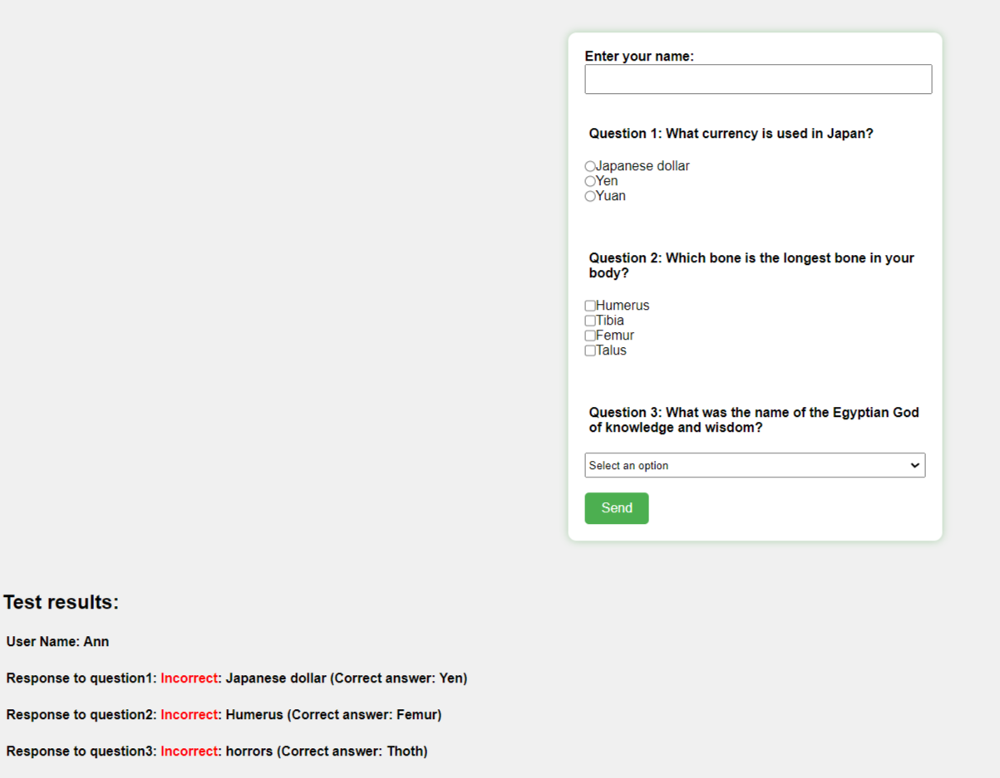

# Отчет по четвертой лабораторной работе

1. [Инструкции по запуску проекта](#1-инструкции-по-запуску-проекта).
2. [Описание проекта](#2-описание-проекта).
3. [Краткая документация к проекту](#3-краткая-документация-к-проекту).
4. [Примеры использования проекта с приложением скриншотов или фрагментов кода](#4-пример-использования-проекта-с-приложением-скриншотов).
5. [Список использованных источников](#5-список-использованных-источников).

## 1. Инструкции по запуску проекта

Данные инструкции действительны при использовании PhpStorm, в ином случае, воспользуйтесь приведенной ссылкой:
[запуск проекта с gitHub](https://www.youtube.com/watch?v=6N6JFynR0gM)

1. Клонируйте репозиторий:
   ```bash
   https://github.com/sharishi/php_labs.git
2. Запустите проект:
   <!-- Если у вас есть веб-сервер (например, Apache или Nginx), настройте его так, чтобы корневой каталог указывал на
   каталог вашего проекта.  
   Если у вас нет веб-сервера, вы можете использовать встроенный сервер PHP для тестирования: -->
   ```bash 
   php -S localhost:8000 labs\lab_3\web\lab4_1.php
   php -S localhost:8000 labs\lab_3\web\lab4_2.php
   php -S localhost:8000 labs\lab_3\web\lab4_3.php
   php -S localhost:8000 labs\lab_3\web\lab4_3_1.php
   php -S localhost:8000 labs\lab_3\web\lab4_4.php

## 2. Описание проекта

Лабораторная работа представляет собой PHP-скрипт, который динамически формирует галерею изображений.

1. В первой части лабораторной(lab4_1) к представленному HTML коду был добавлен код, который отображает сообщение только
   после отправки формы, а также функция для проверки данных, гарантирующая заполнение всех полей и корректность введенного e-mail.
2. Во второй части лабораторной(lab4_2) была создана форма, состоящая из 3 контроллеров (input, select) и к ней же были
добавлены функции обработки данных.
3. В третьей части лабораторной(lab4_3, lab_4_3_1)была также создана форма, только уже по представленному изображению. Также
была создана собственная функция валидации, которая будет проверять все поля формы при получении запроса.
Была также добавлена опция вывода комментария ниже формы.
Дополнительно был рассмотрен и изучен класс Validator.
4. В четвертой части лабораторной (lab4_4) был создан тест из 3-х вопросов используя input, type radio, и input, type checkbox и
   было запрошено имя пользователя. Также была введена проверка заполнения формы и вариантоы, выбранных пользователем.
Результаты были выведены на экран.

## 3. Краткая документация к проекту

#### Lab4_1

```php
 <?php
    if (!empty($_POST)) {
        // Function to validate email
        function isValidEmail($email)
        {
            return filter_var($email, FILTER_VALIDATE_EMAIL);
        }

        if (!empty($_POST["name"]) && !empty($_POST["email"]) && !empty($_POST["review"]) && !empty($_POST["comment"])) {
            // Check if email is valid
            if (isValidEmail($_POST["email"])) {
                ?>
                <div id="result">
                    <p>Ваше имя: <b><?php echo $_POST["name"] ?></b></p>
                    <p>Ваш e-mail: <b><?php echo $_POST["email"] ?></b></p>
                    <p>Оценка товара: <b><?php echo $_POST["review"] ?></b></p>
                    <p>Ваше сообщение: <b><?php echo $_POST["comment"] ?></b></p>
                </div>
                <?php
            } else { ?>
                <p style='color: red;'>Некорректный e-mail</p>
            <?php }
        } else { ?>
            <p style='color: red;'>Пожалуйста, заполните все поля</p>
        <?php }

    } ?>
```

#### Lab4_2

```php
<?php
// Проверяем, была ли отправлена форма
if ($_SERVER["REQUEST_METHOD"] == "POST") {
    // Получаем данные из формы
    $inputNumber = $_POST["inputNumber"];
    $selectOption = $_POST["selectOption"];
    $textareaContent = $_POST["textareaContent"];

    // Проверяем, чтобы поля были заполнены
    if (empty($inputNumber) || empty($selectOption) || empty($textareaContent)) {
        echo "Please fill in all required fields.";
    } else {
        // Выводим данные
        ?>
            <div style="display: flex; flex-direction: column; margin-left: 15px; justify-content: flex-start;
             align-items: flex-start; text-align: left;">
        <p>Введенное число: <?php echo $inputNumber;?><br></p>
        <p>Выбранная опция: <?php echo $selectOption;?><br></p>
        <p>Текстовое поле: <?php echo $textareaContent;?><br></p>
            </div>
        <?php
    }
}
?>
```

#### Lab4_3

```php
<?php

function validateForm($name, $email, $comment, $dataProcessing) {
    $errors = [];

    if (strlen($name) < 3 or strlen($name) > 20 or preg_match('/\d/', $name)) {
        $errors['name'] = 'Name must be between 3 and 20 characters and should not contain digits.';
    }

    if (!filter_var($email, FILTER_VALIDATE_EMAIL)) {
        $errors['email'] = 'Invalid email address.';
    }

    if (empty($comment) and strlen($comment) < 10) {
        $errors['comment'] = 'Comment should not be empty and more widespread';
    }

    if (empty($dataProcessing)) {
        $errors['data_processing'] = 'You must agree with data processing.';
    }

    return $errors;
}

if ($_SERVER['REQUEST_METHOD'] == 'POST') {
    $name = $_POST['name'];
    $email = $_POST['email'];
    $comment = $_POST['comment'];
    $dataProcessing = isset($_POST['data-processing']);

    $errors = validateForm($name, $email, $comment, $dataProcessing);

    if (empty($errors)) {
        echo '<p>Thank you for your comment!😘</p>';
    } else {
        // Вывод формы с сообщениями об ошибках
        echo '<ul>';
        foreach ($errors as $error) {
            echo '<li>' . $error . '</li>';
        }
        echo '</ul>';
    }
}
```
#### Lab4_3_1

```php
<?php
$validator = new Validator();

$validator->addValidation('name', function ($name) {
    return strlen($name) >= 3 and strlen($name) <= 20 and !preg_match('/\d/', $name);
}, 'Name must be between 3 and 20 characters and should not contain digits.');

$validator->addValidation('email', function ($email) {
    return filter_var($email, FILTER_VALIDATE_EMAIL);
}, 'Invalid email address.');

$validator->addValidation('comment', function ($comment) {
    return !empty($comment) && strlen($comment) >= 10;
}, 'Comment should not be empty and have a minimum length of 10 characters.');

$validator->addValidation('data-processing', function ($dataProcessing) {
    return !empty($dataProcessing);
}, 'You must agree with data processing.');

if ($_SERVER['REQUEST_METHOD'] == 'POST') {
    $formData = [
        'name' => $_POST['name'],
        'email' => $_POST['email'],
        'comment' => $_POST['comment'],
        'data-processing' => isset($_POST['data-processing']),
    ];

    $errors = $validator->validateForm($formData);
    if (!empty($errors)) {
        echo '<p>We have a problem! 😘</p>';
        print_r($errors);
    } else {
        echo '<p>Thank you for your comment! 😘</p>';
    }
}
````
#### Lab4_4

```php
<?php
if ($_SERVER["REQUEST_METHOD"] == "POST") {
    // Получение данных из формы
    $username = htmlspecialchars($_POST["username"]);
    $question1 = isset($_POST["question1"]) ? $_POST["question1"] : "";
    $question2 = isset($_POST["question2"]) ? $_POST["question2"] : [];
    $question3 = isset($_POST["question3"]) ? $_POST["question3"] : "";

    // Правильные ответы
    $correct_answers = [
        'question1' => 'Yen',
        'question2' => 'Femur',
        'question3' => 'Thoth',
    ];

    // Вывод результатов
    echo "<h2>Test results:</h2>";
    echo "<p>User Name: $username</p>";

    foreach ($correct_answers as $question => $correct_answer) {
        echo "<p>Response to $question: ";
        $user_answer = isset($_POST[$question]) ? $_POST[$question] : "";

        if (!empty($user_answer)) {
            if (is_array($user_answer)) {
                $user_answer = implode(", ", $user_answer);
            }

            if ($user_answer === $correct_answer) {
                echo "<span style='color:green;'>Correct</span>: $user_answer";
            } else {
                echo "<span style='color:red;'>Incorrect</span>: $user_answer (Correct answer: $correct_answer)";
            }
        } else {
            echo "<span style='color:red;'>Not noted</span>";
        }

        echo "</p>";
    }
}
```

## 4. Пример использования проекта (с приложением скриншотов)

1. [lab4_1](#lab4_1).

   
2. [lab4_2](#lab4_2).

   
3. [lab4_3](#lab4_3).

   

4. [lab4_4](#lab4_4).

   

## 5. Список использованных источников

1. [Валидация в PHP](https://www.w3schools.com/php/php_form_validation.asp)
2. [Вёрстка на Flexbox в CSS](https://medium.com/@stasonmars/вёрстка-на-flexbox-в-css-полный-справочник-e26662cf87e0)