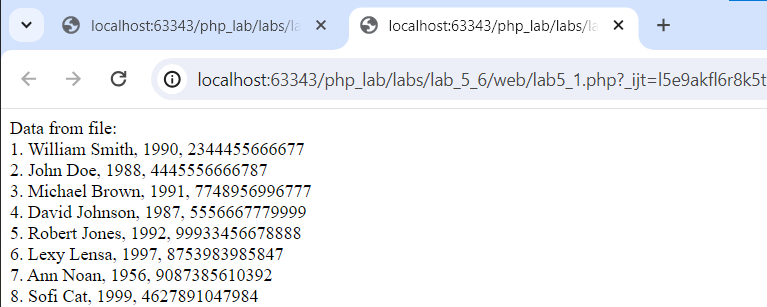
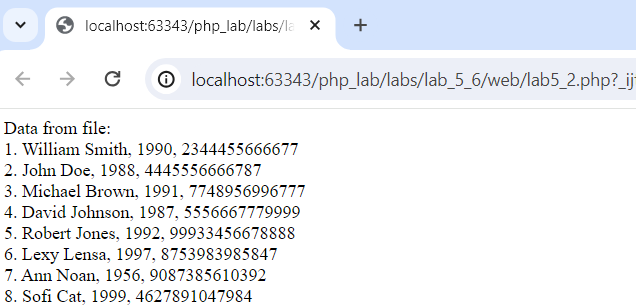
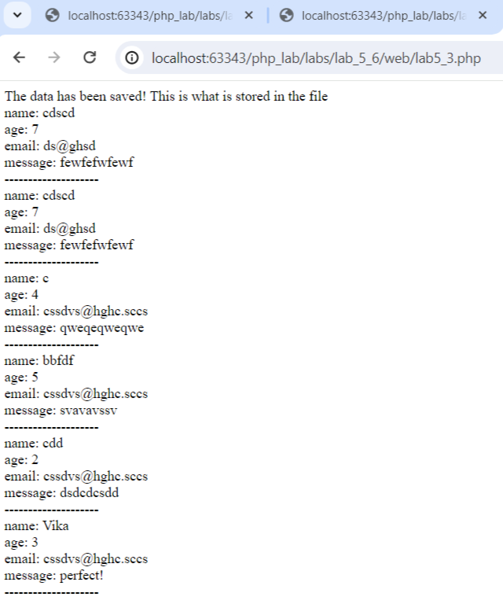
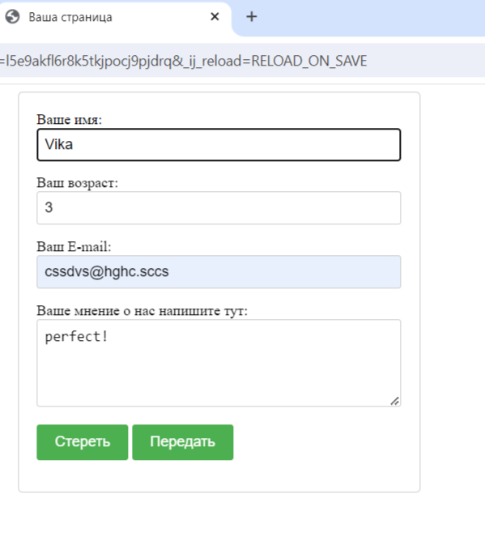
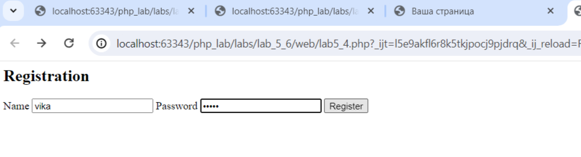
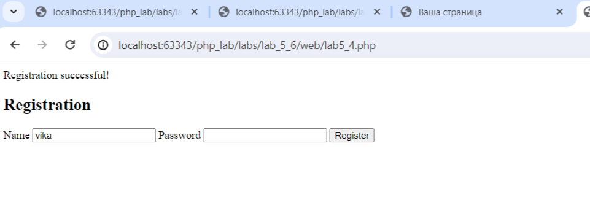
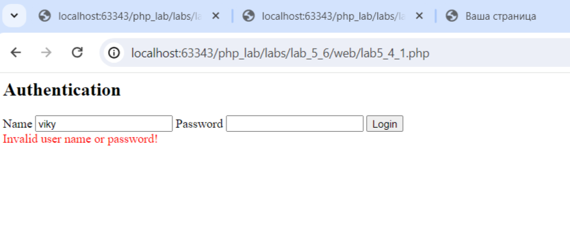

# Отчет по пятой-шестой лабораторной работе

1. [Инструкции по запуску проекта](#1-инструкции-по-запуску-проекта).
2. [Описание проекта](#2-описание-проекта).
3. [Краткая документация к проекту](#3-краткая-документация-к-проекту).
4. [Примеры использования проекта с приложением скриншотов или фрагментов кода](#4-пример-использования-проекта-с-приложением-скриншотов).
5. [Список использованных источников](#5-список-использованных-источников).

## 1. Инструкции по запуску проекта

Данные инструкции действительны при использовании PhpStorm, в ином случае, воспользуйтесь приведенной ссылкой:
[запуск проекта с gitHub](https://www.youtube.com/watch?v=6N6JFynR0gM)

1. Клонируйте репозиторий:
   ```bash
   https://github.com/sharishi/php_labs.git
2. Запустите проект:
   <!-- Если у вас есть веб-сервер (например, Apache или Nginx), настройте его так, чтобы корневой каталог указывал на
   каталог вашего проекта.  
   Если у вас нет веб-сервера, вы можете использовать встроенный сервер PHP для тестирования: -->
   ```bash 
   php -S localhost:8000 labs\lab_5_6\web\lab5_1.php
   php -S localhost:8000 labs\lab_5_6\web\lab5_2.php
   php -S localhost:8000 labs\lab_5_6\web\lab5_3.php
   php -S localhost:8000 labs\lab_5_6\web\lab5_4.php
   php -S localhost:8000 labs\lab_5_6\web\la5_4_1.php

## 2. Описание проекта

1. В первой части лабораторной(lab5_1) было представлено использование функции fwrite.
2. Во второй части лабораторной(lab5_2) была представлена альтернатива fwrite - file_put_contents().
3. В третьей части лабораторной(lab5_3) был добавлен код, который гарантировал сохранение в файл данных с формы и были
   добавлены еще 2 контроллера в форму(возраст и email).
4. В четвертой части лабораторной (lab5_4 и lab5_4_1) был созданы HTML-формы регистрации и авторизации пользователей,где
   PHP-скрипты обрабатывают данные, проверяют их корректность, сохраняют зашифрованные пароли и проверяют соответствие
   логина и пароля в текстовом файле, после чего отправляют соответствующие HTTP-коды и выполняют перенаправление на
   другие страницы при необходимости. в прошедшем времени.

## 3. Краткая документация к проекту

#### Lab5_1

```php
<?php
//создание файла
//$file = fopen("file.txt", "w") or die("Ошибка создания файла!");
////Вводим данные в файл
//fwrite($file, "1. William Smith, 1990, 2344455666677\n");
//fwrite($file, "2. John Doe, 1988, 4445556666787\n");
//fwrite($file, "3. Michael Brown, 1991, 7748956996777\n");
//fwrite($file, "4. David Johnson, 1987, 5556667779999\n");
//fwrite($file, "5. Robert Jones, 1992, 99933456678888\n");
////Закрываем файл
//fclose($file);
//Открываем файл для добавления данных
$file = fopen("../files/file.txt", "a") or die("Error opening for adding data!");
if (!$file) {
    echo("No file was found to add data!");
} else {
    // Добавьте в файл с помощью функции fwrite() еще 3 записи
    fwrite($file, "6. Lexy Lensa, 1997, 8753983985847\n");
    fwrite($file, "7. Ann Noan, 1956, 9087385610392\n");
    fwrite($file, "8. Sofi Cat, 1999, 4627891047984\n");
}
fclose($file);
//Открываем файл для чтения из него
$file = fopen("../files/file.txt", "r") or die("Error opening a file for reading!");
if (!$file) {
    echo("No file was found to read the data!");
} else {?>
    <div>Data from file: </div>
    <?php
    while (!feof($file)) {
        echo fgets($file); ?>
        <br/>
        <?php
    }
    fclose($file);
}

```

#### Lab5_2

```php
<?php
//// Создание файла
//$data = "1. William Smith, 1990, 2344455666677\n"
//    . "2. John Doe, 1988, 4445556666787\n"
//    . "3. Michael Brown, 1991, 7748956996777\n"
//    . "4. David Johnson, 1987, 5556667779999\n"
//    . "5. Robert Jones, 1992, 99933456678888\n";
//
//if (file_put_contents("file.txt", $data) === false) {
//    die("File creation error!");
//}

// Добавление данных в файл
$additional_data = "6. Lexy Lensa, 1997, 8753983985847\n"
    . "7. Ann Noan, 1956, 9087385610392\n"
    . "8. Sofi Cat, 1999, 4627891047984\n";

if (file_put_contents("../files/file.txt", $additional_data, FILE_APPEND) === false) {
    die("Error adding data to a file!");
}

// Открытие файла для чтения
$data_from_file = file_get_contents("../files/file.txt");
if ($data_from_file === false) {
    die("Error opening a file for reading!");
}
?>

<div>Data from file:</div>
<?php
// Вывод данных из файла
$lines = explode("\n", $data_from_file);
foreach ($lines as $line) {
    echo $line . "<br/>";
}
```

#### Lab5_3

```php
<?php } else {
    // Данные с формы
    $data = [
        'name' => isset($_POST['name']) ? $_POST['name'] : "",
        'age' => isset($_POST['age']) ? $_POST['age'] : "",
        'email' => isset($_POST['email']) ? $_POST['email'] : "",
        'message' => isset($_POST['message']) ? $_POST['message'] : "",
    ];
    // Сохранение данных в файл
    $file = fopen('../files/messages.txt', 'a+') or die("Недоступный файл!");
    foreach ($data as $field => $value) {
        // Добавление разделителя между полями
        fwrite($file, "$field: $value\n");
    }
    fwrite($file, "--------------------\n");
    fclose($file);
    // Вывод данных на экран
    echo 'The data has been saved! This is what is stored in the file <br />';
    $file = fopen("../files/messages.txt", "r") or die("Unavailable file!");
    while (!feof($file)) {
        echo fgets($file) . "<br />";
    }
    fclose($file);
}
```

#### Lab5_4

```php
<?php
/**
 * Sanitizes the given data.
 * @param string $data The data to sanitize.
 * @return string The sanitized data.
 */
function sanitizeData(string $data): string
{
    $data = trim($data);
    $data = stripslashes($data);
    return htmlspecialchars($data);
}

$errors = [];
if ($_REQUEST["register"]) {
    // Валидация данных
    if (empty($_POST['login'])) {
        $errors['login'][] = 'Enter a name!';
    }
    if (empty($_POST['password'])) {
        $errors['password'][] = 'Enter your password!';
    }
    // Добавьте другие проверки
    if (count($errors) === 0) {
        $data = [
            'name' => sanitizeData($_POST['login']),
            'password' => md5(sanitizeData($_POST['password']))
        ];
        $log = fopen("../files/users.txt", "a+") or die("Unavailable file!");
        $ifExist = false;
        while (!feof($log)) {
            $line = trim(fgets($log));
            if (strpos($line, $data['name']) !== false) {
                $ifExist = true;
                $errors['login'][] = 'A user with this name already exists!';
                break;
            }
        }
        if (!$ifExist) {
            $log = fopen("../files/users.txt", "a+") or die("Unavailable file!");
            // Сохраняем данные пользователя в файл
            if (fwrite($log, $data['name'] . ':' . $data['password'] . PHP_EOL)) {
                // Если данные успешно записаны, выводим сообщение об успешной регистрации
                echo "Registration successful!";
            } else {
                // Если произошла ошибка при записи данных в файл, выводим сообщение об ошибке
                echo "Error during registration. Please try again later.";
            }
        }
        fclose($log);
    } else {
        // Вывести ошибки валидации
        foreach ($errors as $field => $error) {
            echo implode("<br>", $error);
        }
    }
}

?>
````

#### Lab5_4_1

```php
<?php

/**
 * Sanitizes the given data.
 * @param string $data The data to sanitize.
 * @return string The sanitized data.
 */
function sanitizeData(string $data): string
{
    $data = trim($data);
    $data = stripslashes($data);
    return htmlspecialchars($data);
}

$errors = [];

// Authentication process
if (isset($_POST["auth"])) {
    // Сохранение данных в массив $data
    $data = [
        'login' => sanitizeData($_POST['login']),
        'password' => sanitizeData($_POST['password']),
    ];
    // Проверка данных
    $log = fopen("../files/users.txt", "r") or die("Unavailable file!");
    $ifExist = false;
    while (!feof($log)) {
        $line = trim(fgets($log));
        $line = explode(":", $line);
        if ($line[0] === $data['login']) {
            $ifExist = true;
            if (md5($data['password']) === $line[1]) {
                fclose($log);
                header("Location: ../../lab_3/web/lab3_4.php");
                exit; // Exit after redirect
            } else {
                $errors['auth'][] = 'Invalid user name or password!';
                break;
            }
        }
    }
    // Действия, если пользователь не найден
    if (!$ifExist) {
        $errors['auth'][] = 'User not found!';
    }
    fclose($log);
}

?>
```

## 4. Пример использования проекта (с приложением скриншотов)

1. [lab5_1](#lab5_1).
   

2. [lab5_2](#lab5_2).
   

3. [lab5_3](#lab5_3).
   
   

4. [lab5_4](#lab5_4).
   
   

5. [lab5_4_1](#lab5_4_1).
   

## 5. Список использованных источников

1. [PHP Manual](https://www.php.net/manual/en/index.php)
2. [PHP Tutorial](https://www.php.engineer/)