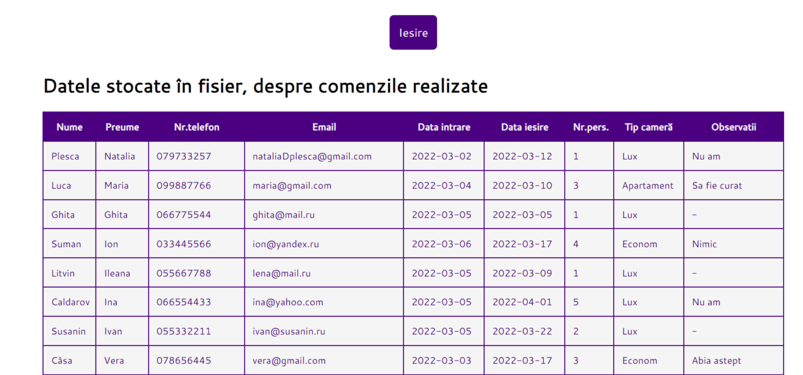

# Отчет по пятой-шестой лабораторной работе

1. [Инструкции по запуску проекта](#1-инструкции-по-запуску-проекта).
2. [Описание проекта](#2-описание-проекта).
3. [Краткая документация к проекту](#3-краткая-документация-к-проекту).
4. [Примеры использования проекта с приложением скриншотов или фрагментов кода](#4-пример-использования-проекта-с-приложением-скриншотов).
5. [Список использованных источников](#5-список-использованных-источников).

## 1. Инструкции по запуску проекта

Данные инструкции действительны при использовании PhpStorm, в ином случае, воспользуйтесь приведенной ссылкой:
[запуск проекта с gitHub](https://www.youtube.com/watch?v=6N6JFynR0gM)

1. Клонируйте репозиторий:
   ```bash
   https://github.com/sharishi/php_labs.git
2. Запустите проект:
   <!-- Если у вас есть веб-сервер (например, Apache или Nginx), настройте его так, чтобы корневой каталог указывал на
   каталог вашего проекта.  
   Если у вас нет веб-сервера, вы можете использовать встроенный сервер PHP для тестирования: -->
   ```bash 
   php -S localhost:8000 labs\lab_7\admin\index.php

## 2. Описание проекта

Данный проект демонстрирует работу сессий и ее переменных.
Данный проект направлен на работу с сессиями и их переменными. Сессии представляют собой механизм хранения информации о пользователе на сервере в течение определенного
периода времени. Они позволяют сохранять состояние между запросами клиента, обеспечивая таким образом непрерывное
взаимодействие пользователя с веб-приложением.

## 3. Краткая документация к проекту

#### index.php

```php
<?php
session_start();
require 'config.php';
if (isset($_REQUEST['ok'])) {
    if ((isset($_POST["login"])) and (!empty($_POST['login'])) and (isset($_POST["pass"])) and (!empty($_POST['pass']))) {
        $password = $_POST["pass"];
        $login = $_POST["login"];
        $log = fopen("data/accounts.txt", "r") or die("Nu a fost gasit fisierul!");
        $exist = false;
        while (!feof($log)) {
            $extras = trim(fgets($log));
            $date_cont = explode(" ", $extras);
            if (($date_cont[0] == $login) and ($date_cont[1] == md5($password))) {
                $exist = true;
            }
        }
        fclose($log);
        if ($exist) {
            $_SESSION['user'] = $login;
            header('Location: http://' . $_SERVER['SERVER_NAME'] . $path . '/view_data.php');
            echo $path;
        } else {
            header('Location: http://' . $_SERVER['SERVER_NAME'] . $path . '/');
        }
    }
}
?>

```

#### logout.php

```php
<?php
    require 'config.php';
    session_start();
    session_destroy();

    header('Location: http://'.$_SERVER['SERVER_NAME'].$path.'/');
```

#### signUp.php

```php
<?php
	session_start(); 
	require 'config.php';
	if ((isset($_POST["login"]))and(!empty($_POST['login']))and(isset($_POST["pass"]))and(!empty($_POST['pass']))) {
		$password=$_POST["pass"];
		$login=$_POST["login"];
		$exist=false;
		if (!file_exists($fileName)) {
			$txt=fopen("$fileName","a") or die("Fisier inaccesibil!");
			$log=$_POST["login"];
			fwrite($txt, $log);
			$spatiu=" ";
			fwrite($txt,$spatiu);
			$password=md5($_POST["pass"]);
			fwrite($txt,$password);
			$enter="\n";
			fwrite($txt,$enter);
			fclose($txt);
			$initial= true;
			$mesaj = "Contul a fost creat!";
		}
		$log=fopen($fileName, "r+")or die("Nu a fost gasit fisierul!");
		while(!feof($log))
		{
			//trim — sterge spatiile si alte simboluri de la inceputul si sfarsitul sirului
			$extras=trim(fgets($log));
			if($extras == $login.' '.md5($password)) {
				$exist=true;
			}
		}
		fclose($log);
		$mesaj = "";
		if ($exist==true){
			$mesaj = "<span class='error'>Un cont cu acest login si parola deja exista!!!<br />Introdu alte date pentru inregistrare!</span>";
		} elseif($initial==true){
			$mesaj = "<span class='error'>Este primul cont creat!</span>";
		} else {
			$txt=fopen("$fileName","a") or die("Fisier inaccesibil!");
			$log=$_POST["login"];
			fwrite($txt, $log);
			$spatiu=" ";
			fwrite($txt,$spatiu);
			$password=md5($_POST["pass"]);
			fwrite($txt,$password);
			$enter="\n";
			fwrite($txt,$enter);
			fclose($txt);
			$mesaj = "<span class='error'>Contul a fost creat!</span>";
		}
	}
?>
```

#### view_data.php

```php
<?php 
    require 'config.php';
    session_start(); 
    if(!$_SESSION['user']) { 
        header('Location: http://'.$_SERVER['SERVER_NAME'].$path.'/');
    }   
    ...
  $myData=fopen("data/dateRezervari.txt", "r")or die("Nu a fost gasit fisierul!");
                while(!feof($myData))
                {
                    echo "<tr>";
                    $record=trim(fgets($myData));
                    $row = explode("\t", $record);
                    foreach($row as $item){
                        echo "<td>".$item."</td>";
                    }
                    echo "</tr>";
                }
                fclose($myData);
````


## 4. Пример использования проекта (с приложением скриншотов)

1. [index.php](#indexphp).
   

2. [signup.php](#signupphp).
   

3. [view_data.php](#view_dataphp).
   


## 5. Список использованных источников

1. [PHP Reference](https://www.w3schools.com/php/php_ref_overview.asp)
2. [PHP Documents](https://yaaver.com/php-help/)