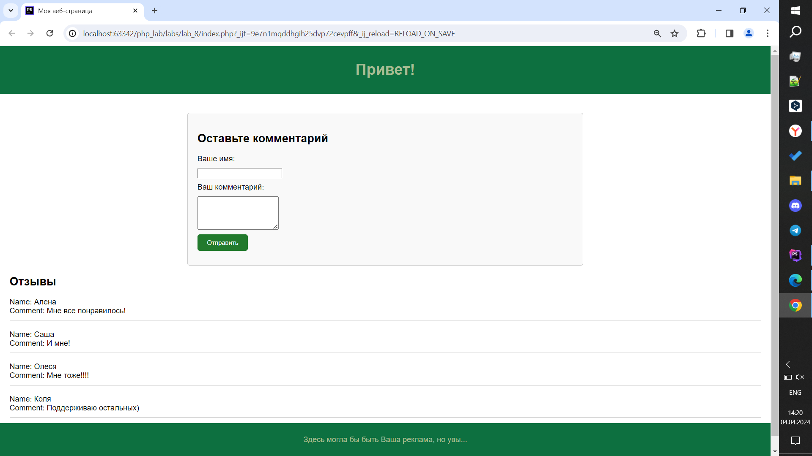

# Отчет по восьмой лабораторной работе

1. [Инструкции по запуску проекта](#1-инструкции-по-запуску-проекта).
2. [Описание проекта](#2-описание-проекта).
3. [Краткая документация к проекту](#3-краткая-документация-к-проекту).
4. [Примеры использования проекта с приложением скриншотов или фрагментов кода](#4-пример-использования-проекта-с-приложением-скриншотов).
5. [Список использованных источников](#5-список-использованных-источников).

## 1. Инструкции по запуску проекта

Данные инструкции действительны при использовании PhpStorm, в ином случае, воспользуйтесь приведенной ссылкой:
[запуск проекта с gitHub](https://www.youtube.com/watch?v=6N6JFynR0gM)

1. Клонируйте репозиторий:
   ```bash
   https://github.com/sharishi/php_labs.git
2. Запустите проект:
   <!-- Если у вас есть веб-сервер (например, Apache или Nginx), настройте его так, чтобы корневой каталог указывал на
   каталог вашего проекта.  
   Если у вас нет веб-сервера, вы можете использовать встроенный сервер PHP для тестирования: -->
   ```bash 
   php -S localhost:8000 labs\lab_8\admin\index.php

## 2. Описание проекта

Данный проект важность и необходимость использования include и require.
Этот проект реализует запись данных, введенных пользователем в веб-форме, в файл.
Затем данные из файла выводятся для дальнейшего использования.
В данном проекте все части программы находятся в разных папках для организации структуры проекта и улучшения
его модульности.
Это помогает управлять проектом более эффективно, так как разные части могут разрабатываться независимо друг от друга,
а также легко масштабировать проект в будущем.

## 3. Краткая документация к проекту

#### index.php

```php
<body>

<?php
require "views/components/header.php"
?>

<main>
<?php
require "views/components/form.php";
//require "views/components/comments.php";
require "views/components/Part.php";
Part::part('views/components/comments'); ?>
</main>
<?php
require "views/components/footer.php"
?>

</body>
?>

```

#### comments.php

```php
<?php
$filePath = "handlers/comments.txt";

// Проверяем, существует ли файл
if (file_exists($filePath)) {
    // Читаем содержимое файла
    $comments = file_get_contents($filePath);

    // Разбиваем содержимое файла на массив комментариев
    $commentsArray = explode("\n\n", $comments);

    // Выводим каждый комментарий
    foreach ($commentsArray as $comment) {
        if (!empty($comment)) {
            echo '<div class="comment"><p>' . nl2br($comment) . '</p></div>';
        }
    }
} else {
    echo 'Файл с комментариями не найден.';
}
?>

```

#### form.php

```php
<form action="handlers/form-handler.php" method="post">
    <h2>Оставьте комментарий</h2>
    <label for="name">Ваше имя:</label>
    <input type="text" id="name" name="name" required>
    <label for="comment">Ваш комментарий:</label>
    <textarea id="comment" name="comment" rows="4" required></textarea>
    <input type="submit" value="Отправить">
</form>

```

#### form_handler.php

```php
<?php
// Путь к файлу, в который будут сохраняться комментарии
$filePath = 'comments.txt';

// Получаем данные из формы
$name = $_POST['name'] ?? '';
$comment = $_POST['comment'] ?? '';

// Формируем строку для записи в файл
$commentData = "Name: $name\nComment: $comment\n\n";

// Открываем файл для добавления новой информации
$fileHandle = fopen($filePath, 'a');

if ($fileHandle) {
    fwrite($fileHandle, $commentData);
    fclose($fileHandle);
    header("Location: ../index.php");
    echo "Комментарий успешно сохранен.";
} else {
    echo "Ошибка при сохранении комментария.";
}
```

## 4. Пример использования проекта (с приложением скриншотов)

1. [index.php](#indexphp).
   


## 5. Список использованных источников

1. [PHP Reference](https://www.w3schools.com/php/php_ref_overview.asp)
2. [PHP Documents](https://yaaver.com/php-help/)